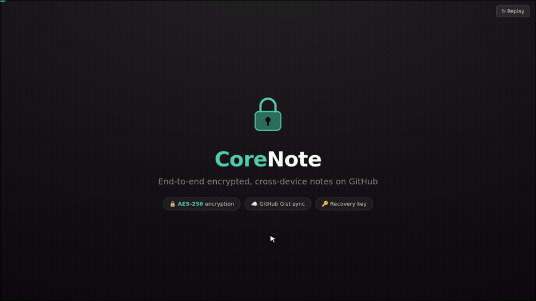

# CoreNote

**End-to-end encrypted, cross-device notes for VS Code — backed by your own GitHub Gists.**

Write a note like a normal file, press **Ctrl+S**, and the content is encrypted and pushed to
GitHub. Sign in with the same GitHub account on any other computer, enter your master password,
and your notes are decrypted and waiting for you.

## Features

- **End-to-end encryption.** Note content *and* titles are encrypted with AES-256-GCM before they
  ever leave your machine. Nothing is stored as plaintext on GitHub.
- **Cross-device sync.** Notes live in your GitHub Gists, so they follow you to every computer.
- **One-tap GitHub sign-in.** Uses VS Code's built-in GitHub authentication — no tokens to paste.
- **Recovery key.** Forget your password? A recovery key generated at setup gets you back in.
- **Folders, nested as deep as you like.** Use `/` in a title, or right-click to create folders
  and subfolders.
- **Native editing.** Open a note, edit it, and `Ctrl+S` saves straight to the cloud.

## How it works

Each note is a private GitHub Gist. A single random **master key** encrypts every note; that key
is itself "wrapped" by your **master password** and your **recovery key**, then stored — only in
wrapped form — in a small keyring gist. Without the password or recovery key, the data is
unreadable. Your master password is kept in the OS keychain on each device and is **never synced**.

## Getting started

1. Install CoreNote and open the **CoreNote** icon in the activity bar.
2. **Sign in with GitHub** (the `gist` scope is requested).
3. Set a **master password** and save the **recovery key** you're shown — it is shown only once.
4. **New Note**, give it a title (use `/` for folders), type, and press **Ctrl+S**.

On another computer, install CoreNote, sign in with the same GitHub account, and enter the same
master password once.

## Security

- If you forget your password, use your **recovery key** to regain access.
- If you lose **both** the password and the recovery key, your notes cannot be recovered — there
  is no other copy of the key. This is the nature of true end-to-end encryption.
- Changing your password does not re-encrypt your notes; only the key wrap is renewed.
- New single-file notes use a fixed file name so the title is not leaked through it.

## Commands

- **New Note** / **New Folder** — from the toolbar or by right-clicking in the sidebar.
- **New Note in This Folder** — right-click a folder.
- **Rename / Move Folder** — bulk-moves every note underneath.
- **Change Master Password** · **Generate New Recovery Key** · **Forget Master Password on This Device**.

## Privacy

CoreNote stores your notes only in your own GitHub account. It sends no data anywhere else and has
no analytics. Folder names and titles are encrypted; the keyring gist contains only wrapped keys.

## Support

If CoreNote is useful to you, you can support its development:

## License

MIT
